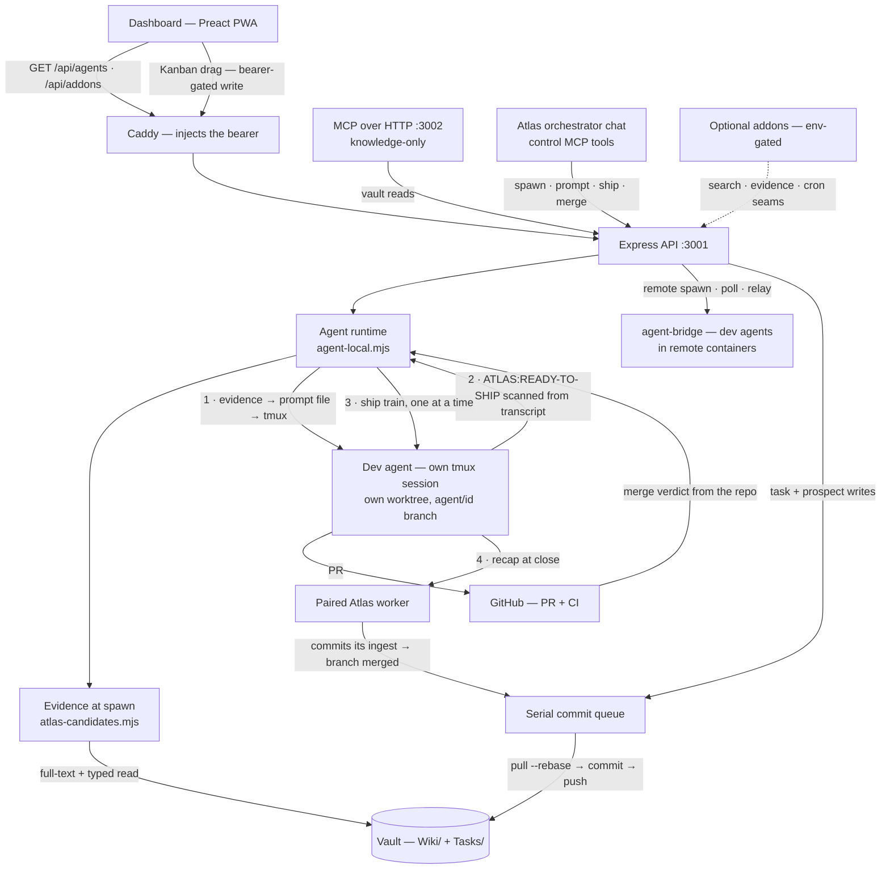

# Atlas Kit

**A self-hosted runtime that drives an [Atlas](https://github.com/GregorKoehler/llm-atlas)
knowledge vault with Claude Code agents.** A glass-HUD dashboard, dev + knowledge
agents running in tmux, and a task Kanban — all wired to a single markdown vault.

> **Atlas Kit is the harness; [llm-atlas](https://github.com/GregorKoehler/llm-atlas)
> is the knowledge-base template it pairs with.** The Atlas is an agent-maintained,
> typed, queryable markdown wiki (Karpathy's LLM-wiki pattern + a relational overlay).
> Atlas Kit is what runs *around* it: the dashboard, the agent orchestration, and the
> box setup. Atlas Kit does **not** ship a vault — you create yours from the llm-atlas
> template and point `VAULT_PATH` at it.

Extracted and generalized from a larger personal command-center ("Gravis"), pared
down to the pieces worth reusing.


<sub>Preview render with **sample data** — the default Contrast Claude (warm-paper) theme. The real app is Preact + Tailwind; this is a static mock.</sub>

---

## Production setup — two ways

For a real box (a Hetzner server behind a Cloudflare Tunnel + Access, systemd, cron,
optional remote bridge), pick whichever you prefer:

- **Agent-guided setup (the easy path) — [docs/SETUP-AGENT.md](docs/SETUP-AGENT.md).**
  Rent a box, SSH in, install the `claude` CLI + `gh` and log both in, clone the repo,
  run `claude` in it, and say *"Read docs/SETUP-AGENT.md and set me up."* A Claude Code
  agent then interviews you, runs the whole install, and verifies each step.
- **Manual setup — [docs/SETUP.md](docs/SETUP.md).** The same ten steps as a
  zero-to-running walkthrough you run by hand.

For a quick local look first, see [Quick start (local dev)](#quick-start-local-dev).

---

## The six pillars

### 1. Dev agents in tmux via Claude Code — the core
Spawn a Claude Code session in a `tmux` window on a repo, drive it, and watch its
transcript live. Each agent gets its own **`git worktree`** on an `agent/<id>`
branch. You can **prompt** it, **queue** a message (lands at its next idle),
**schedule** one for a future time, **interrupt & steer** a running turn, **kill**
(keep the worktree for review), or **cleanup** (remove worktree + branch). Idle vs.
busy is detected from the terminal; numbered menus are answerable from the card.
You can **attach files** to a spawn or a prompt, and anything the agent drops into
its own per-session downloads dir comes back as a **⬇ chip** on its card — images
open in an in-app preview so an installed (home-screen) PWA is never navigated
away from, everything else hands off without leaving the app.
Extracted from the Gravis agent runtime — simplified but functional. See
[docs/PROTOCOLS.md](docs/PROTOCOLS.md) for exactly what each of these does and where.

### 2. Knowledge-base coupling
The workflow where dev agents (a) **start with what the vault already knows**,
(b) work, and (c) on close **commit their insights back** into the Atlas — a project
page update, a `Wiki/log.md` entry, a filed `Tasks/` item.

The first half is **retrieval, not a briefing turn**: the server searches the Atlas
itself at spawn — full-text (BM25-ranked, excerpted) plus the typed layer (the repo's
project page, its open `Tasks/`, its recent hazards) — and folds the result straight
into the agent's opening prompt, framed as a candidate set rather than as orders. Atlas
chats open with the same block. Box-local dev agents also hold the seven **read-only**
vault tools (`query_atlas`, `query_vault`, `get_note`, …) to go deeper; writing back is
the paired knowledge worker's job at cleanup. All the prompt scaffolding for this ships
here, generalized to *your* vault — see [docs/PROTOCOLS.md](docs/PROTOCOLS.md) §4.

### 3. Kanban coupled to the KB
A drag-and-drop **Kanban** over the vault's `Tasks/` (`type: task`, status
`inbox | next | doing | waiting | done`). **Every** change — including a status drag —
commits through a **serial git commit queue** (`pull --rebase --autostash` → edit →
commit → push, with lock-race + non-fast-forward retries), so concurrent writes never
race the one checkout. A daily cron **archives** completed tasks off the board (kept in
git history, never deleted).

Agents don't file onto that board directly. Work an agent *notices* while doing something
else goes to a **Task Prospects** inbox instead — stored outside the vault, so a rejected
proposal never touches it — and only becomes a real `Tasks/` note when you approve it, over
that same commit queue. Propose, don't file (`docs/PROTOCOLS.md` §8).

### 4. Knowledge agents
Chat-over-the-vault agents that answer grounded in the KB (with citations), can kick
off research, and — as the **orchestrator** — can spawn and steer the dev agents. This
is the Atlas-agent pattern, including its **MCP control surface**: `list_agents`,
`agent_transcript`, `spawn_agent`, `prompt_agent`, `queue_agent`, `interrupt_agent`,
`kill_agent`, `cleanup_agent`, plus `query_vault` (fuzzy full-text), `query_atlas`
(exact relational/temporal queries over the typed layer) and `propose_task`.

Agents can also talk to **each other**: `agent-msg <id> "<text>"` is async peer mail,
bounded by the spawn lineage (parent / child / sibling) and a per-pair send budget, landing
at the recipient's next tool-call boundary. Agents on a remote bridge get the same command,
plus `atlas-query` for read-only vault queries relayed over the existing bridge channel —
no new network exposure (`docs/PROTOCOLS.md` §7).

### 5. Git workflow
One **`git worktree` per dev agent**, a **branch per agent**, and a strict
**rebase-before-push** discipline (`git pull --rebase --autostash` before any push).
Vault log files use `*.md merge=union` so append-only history (`log.md`, `index.md`)
merges without conflicts across writers (your phone's Obsidian Git, an agent, the
Kanban). See **[Git workflow](#git-workflow-1)** below.

### 6. Main page with project cards
One card per project showing its dev agents with spawn buttons — including **remote
spawn** via a bridge (the workstation-over-Tailscale pattern, `bridges.json`). Kept
visually close to the source: the **scorecard**, the **Atlas search**, the **hero
overview**, and the **glass-HUD** look (Tailwind + CSS-variable design tokens).

The kit ships **its own card**: setup seeds `Wiki/Projects/Atlas-Kit.md` into your vault
(`scripts/seed-self-card.mjs` — idempotent, never overwrites), and any card whose page
carries `self_deploy: true` + `repo_path:` gets a **Redeploy** button: fetch →
fast-forward merge → install deps only if a lockfile moved → build → `serve.sh restart`,
run in a transient `systemd-run` unit so it survives restarting the API that launched it.
It refuses a dirty or diverged checkout with the reason instead of forcing anything —
[docs/UPDATING.md](docs/UPDATING.md).

---

## Components & how they fit together

Two things are load-bearing: **one Express process** on the box, and **one git
checkout of your vault**. Everything else either talks to that API or writes to that
vault — and every vault write goes through a single serial queue, so "what is allowed
to touch the checkout" has exactly one answer.



### The parts

| Component | What it is | Where |
|---|---|---|
| **Web dashboard** | Vite + Preact + TS glass-HUD PWA, one file per card. One module-level poll feeds every card — 5s while an agent is alive, 30s idle, paused on a hidden tab. | `web/`, `web/src/lib/useAgents.ts` |
| **Express API** | The single process behind everything: agent routes, vault reads, Kanban writes, the prospect inbox. Binds `127.0.0.1`; Caddy fronts it and injects the bearer. | `api/src/server.mjs` |
| **MCP surfaces** | One tool core, two transports. **stdio** for local Claude Code, across four `*.mcp.json` profiles: dev agents and the paired worker get the seven read tools + `propose_task`; only the Atlas orchestrator's `control.mcp.json` sets `ATLAS_AGENT_CONTROL=1` and unlocks `spawn_agent`/`ship_agent`/`merge_pr`/`kill_agent`/…. **HTTP** (`:3002`, behind a Cloudflare Access JWT) is knowledge-only *by construction* — it passes `agentControl: false` unconditionally, so no env var can put agent control on it. | `api/src/mcp/` |
| **Dev-agent runtime** | Spawns `claude` in its own detached tmux session on a fresh `git worktree`. Queued messages land at the next **tool-call boundary** for course-changing kinds and a full idle for observational ones — one shared decision module, so box and bridge can't drift. | `api/src/agent-local.mjs`, `queue-delivery.mjs` |
| **Transcript scanner** | Tail-reads the session JSONL for two things: the `ATLAS:READY-TO-SHIP` / `ATLAS:SHIPPED` ship markers (assistant text only, latest wins) and the sub-agents a session fanned out to. | `api/src/subagent-scan.mjs` |
| **Evidence at spawn** | The server searches the Atlas *itself* before the agent starts — full-text plus the typed layer — and folds one byte-capped block into the opening prompt, which travels by **file** because tmux rejects a command over ~16 KB. Never blocks, never throws. | `api/src/atlas-candidates.mjs`, `prompt-file-launch.mjs` |
| **Serial commit queue** | The one serialization point for every vault write — Kanban drags, worker ingests, the done-clear cron. One in-process mutex; merges run in an isolated detached worktree. | `api/src/atlas-commit-queue.mjs` |
| **The vault** | A separate repo, created from the [llm-atlas](https://github.com/GregorKoehler/llm-atlas) template. `Wiki/` is the knowledge; `Tasks/` is the Kanban's backing store. Never bundled into this repo. | `VAULT_PATH` |
| **Knowledge agents** | Chat over the vault. On the vault keyed `atlas` the chat becomes the **orchestrator** and can drive the fleet. Each dev agent also gets a **paired worker** that writes the run's insights back at close — the dev agent itself never writes the Atlas. | `api/src/agent-local.mjs`, `agent-routes.mjs` |
| **agent-bridge** | A dependency-free host-native executor on another machine, reached over Tailscale with a bearer, driving dev containers via `docker exec`. Its agents get peer mail and read-only Atlas queries relayed over the same channel — no new listening socket. | `agent-bridge/` |
| **Self card + Redeploy** | The kit's own project card, seeded into the vault at setup. `self_deploy: true` + `repo_path:` on any project page adds a bearer-gated, single-flight Redeploy button; the run lives in a transient systemd unit (detached `setsid` fallback) and reports back through a state file, since it restarts the API mid-flight. | `scripts/seed-self-card.mjs`, `api/src/deploy-routes.mjs`, `docs/UPDATING.md` |
| **Claude Code skills** | Four operator workflows shipped with the repo: `fleet-status`, `ship-protocol`, `deep-research`, `update-config`. | `.claude/skills/` |
| **Optional addons** | Env-gated directories with an `api/register.mjs` manifest. Four ship today: `semantic-search`, `instagram-ingest`, `news-ingest`, `voice`. Zero enabled = byte-identical to a kit without the framework. | `addons/` |
| **Model-provider profiles** | Optional named backends a dev agent or a knowledge chat can spawn against — the **unchanged** Claude-Code harness pointed at an Anthropic-compatible endpoint (DeepSeek via OpenRouter, DeepSeek direct, …). No second agent CLI; no profiles configured = byte-identical to a kit without the feature. | `api/src/providers.mjs`, [docs/PROVIDERS.md](docs/PROVIDERS.md) |
| **scripts / infra / CI** | `serve.sh` runs three tmux windows (Express, Caddy, the MCP HTTP server) with a `--env-file` and no inherited API key; cron does a 15-min vault refresh, a daily done-clear, a 2-min health watchdog and (once `ATLAS_GITHUB_USER` is set) a half-hourly GitHub-contributions pull for the Scorecard. CI globs every `*.test.mjs` under `api/test` and `addons/*/test` and subtracts an explicit opt-out list, so **adding a test file is enough to gate it**. | `scripts/`, `infra/`, `.github/workflows/ci.yml` |

### The flows

**Spawn → work → ship → merge.** A spawn retrieves Atlas evidence server-side, writes
it to a prompt file, and launches `claude` in its own tmux session on a fresh worktree. The
agent works; when it judges its branch mergeable it ends a reply with
`ATLAS:READY-TO-SHIP`, which the runtime reads off the transcript rather than from any
in-memory flag. Ready agents join a **serial ship train** and are shipped one at a time,
so each re-syncs onto the previous merge instead of racing it. `READY-TO-SHIP` means
*a PR is open and believed mergeable* — nothing more; `merged` is not a claim at all but
a verdict the runtime gets by asking the repository. On close the dev agent writes a
recap, its paired worker folds that into the vault on its own branch, and once that
close turn finishes the branch is merged through the queue and the session is reaped.

**Every vault write is serialized.** A Kanban drag, an approved task prospect, a worker
ingest and the nightly done-clear all funnel through the same mutex, each doing
`pull --rebase --autostash` → mutate → commit → push with retries. The vault is one
checkout shared with a phone's Obsidian Git and a refresh cron — the queue is what keeps
those from racing.

**The UI reads two endpoints to know what exists.** `GET /api/agents` is the whole fleet
in one poll — box-local sessions, each bridge's roster, and a stale bridge's last-known
sessions kept *separate* from live ones. `GET /api/addons` answers what is enabled on
this box, so one build of `web/dist` serves every install and a card appears because the
addon is enabled here, never because someone compiled a different bundle.

These are conventions with hazards attached; the full map is
**[docs/PROTOCOLS.md](docs/PROTOCOLS.md)**, and the addon seams are
**[docs/ADDONS.md](docs/ADDONS.md)**.

---

## Dev agents vs. knowledge agents

They share the same access primitives (both run `claude` in a `tmux` window on the box,
both appear on `GET /api/agents`, both use the same transcript UI) — but the **contract
differs**:

| | **Dev agent** | **Knowledge agent** |
|---|---|---|
| Lives in | a `git worktree` of **one repo**, on an `agent/<id>` branch | the **vault** root (no branch) |
| Output | code → opens a **PR**, ships it | vault pages (add-and-link), `Tasks/`, `log.md` |
| Role | do a scoped engineering task | **answer, research, and orchestrate** the others |
| Extras | ship/sync buttons, live-app preview | MCP agent-control tools (spawn/steer/kill) |

In short: a **dev agent** is a coding worker isolated to a branch of one repo; a
**knowledge agent** lives over the vault, answers from it, writes durable knowledge
back, and — on the vault keyed `atlas` — becomes mission control for the fleet. The
distinction is exactly the two different *contracts* layered on the same runtime.

---

## Architecture

```
web/          Vite + Preact + TypeScript dashboard (glass-HUD; one file per card)
  src/components/cards/   Projects, Scorecard, Hero, Kanban, KnowledgeAgents, AgentList, …
  src/lib/api.ts          the single /api client (one API_BASE)
  src/styles/             design tokens (CSS vars) + Tailwind
api/          Express API + the agent runtime + the MCP server
  src/agent-local.mjs     box-local executor (git worktree + tmux + claude, directly)
  src/claude-bin.mjs      resolves ONE absolute `claude` path at boot (CLAUDE_BIN, PATH,
                          ~/.local/bin, /usr/local/bin) — cron/systemd give a bare PATH
  src/agent-routes.mjs    /api/agents/* routes + the agent preambles
  src/atlas-commit-queue.mjs   the serial vault commit queue (pillar 3 + 5)
  src/atlas-query.mjs     the typed relational/temporal query engine (query_atlas)
  src/read-routes.mjs     open GET reads: notes, wiki, search, tasks, projects
  src/atlas-routes.mjs    Kanban task writes + the Task Prospects inbox (bearer-gated)
  src/deploy-routes.mjs   the Redeploy button on a `self_deploy` card (docs/UPDATING.md)
  src/atlas-prospects.mjs agent-PROPOSED tasks awaiting sign-off (server-side, never the vault)
  src/mcp/                the MCP server (query_vault/query_atlas + agent control)
  src/providers.mjs       optional model-BACKEND profiles for a spawn (docs/PROVIDERS.md)
  src/bridges.mjs         repo → remote-bridge routing
  src/bridge-roster.mjs   each bridge's last-known roster, so "we could not ask" ≠ "there is nothing there"
  src/agent-capacity.mjs  ONE spawn-admission rule, shared by the box, the API and each bridge
  src/agent-messages.mjs  the agent↔agent mail bus log (+ its per-pair send budget)
  src/atlas-query-relay.mjs  read-only Atlas queries for REMOTE agents, over the bridge channel
agent-bridge/ Host-native bridge to drive agents in remote dev containers (Tailscale)
addons/       OPTIONAL, env-gated features (docs/ADDONS.md). Zero enabled = zero cost.
  semantic-search/        dense/vector retrieval as a SECOND search leg
scripts/      serve.sh (tmux service manager), refresh-atlas, clear-done, seed-self-card,
              refresh-github (optional Scorecard stat), provisioning
infra/        Caddyfile.example, cloudflared-config.example.yml, atlas-kit.cron,
              atlas-kit-card.template.md (the self card setup seeds)
```

**Request/auth model:** the browser talks to Caddy on one origin. Read routes are open
(Cloudflare Access gates identity at the edge); every write/exec route is **bearer-gated**,
and Caddy injects `DASHBOARD_BEARER_TOKEN` server-side so the browser never holds it. The
Express API binds `127.0.0.1` only. LLM calls shell out to the **`claude` CLI on your
subscription** — no API keys, unless you opt one spawn onto a
[provider profile](docs/PROVIDERS.md).

---

## Git workflow

This is a headline feature, not an implementation detail:

- **One worktree + one branch per dev agent.** `spawn` runs `git worktree add -b
  agent/<id> <path>` off the repo, so parallel agents on the same repo never stomp each
  other's working tree; they share one `.git`. `kill` keeps the worktree/branch for
  review; `cleanup` removes them.
- **Rebase before every push.** Agents are steered (via their preamble) to
  `git fetch` → `git rebase origin/<main>` → `git push --force-with-lease`, and to
  re-sync on a fresh fetch before merging a PR. The executor itself never pushes — a
  human (or the orchestrator) drives merges.
- **Serial commit queue for the vault.** All vault writes (Kanban drags, agent
  ingests, the done-clear cron) funnel through one in-process mutex that does
  `pull --rebase --autostash` → mutate → commit → push, with retries for lock races and
  non-fast-forward pushes.
- **`*.md merge=union` for logs.** Add a `.gitattributes` with `*.md merge=union` to
  your vault (the llm-atlas template already does) so append-only files like `log.md`
  and `index.md` merge cleanly across your phone, agents, and the Kanban. Its one cost —
  two writers rewriting the *same* frontmatter line leave a duplicate YAML key, which
  silently untypes the whole page — is **self-healed** after every pull/rebase/merge in
  the commit queue, and survived by the readers in between
  ([PROTOCOLS §5a](docs/PROTOCOLS.md#5a-union-merge-doubles-a-frontmatter-key--and-that-silently-deletes-a-card)).

---

## Quick start (local dev)

Requirements: **Node ≥ 20**, **`tmux`**, and the **`claude` CLI** logged in on your
subscription (`claude` → `/login`). You also need a vault — create one from the
[llm-atlas template](https://github.com/GregorKoehler/llm-atlas) (or point at any
folder with `Wiki/` + `Tasks/`).

```bash
git clone https://github.com/GregorKoehler/atlas-kit && cd atlas-kit
cp .env.example .env          # set VAULT_PATH + DASHBOARD_BEARER_TOKEN (openssl rand -hex 32)
npm run install:all           # installs api/ and web/ deps
npm run dev                   # Express API + Vite dev server → http://127.0.0.1:5173
```

To spawn a **box-local dev agent**, copy `api/src/agent-local-repos.example.json` to
`api/src/agent-local-repos.json` and add a repo you have checked out on this machine
(this is the spawn allowlist — the security boundary).

**What becomes a project card:** a page in your vault's `Wiki/Projects/` with
`type: project` **and** a non-empty `goal:`. That pair is the opt-in — the folder is a
normal Atlas folder and may hold project pages that aren't cards yet, so `goal:` (the
line the card renders) is what promotes one. Everything else is optional: `now:`,
`tag:` (the related-notes count), `repo:` (a local checkout path), `github:`, and
`agent_repo:` — the spawnable-repo key that binds the card to a dev-agent surface.

## Optional addons

Anything with a heavier class of dependency than "read markdown off disk" ships as an
**addon**: a self-contained directory under `addons/<name>/`, loaded only when you
enable it with `ATLAS_ADDONS` or `addons.json`. With none enabled the kit behaves
exactly as if the framework were not there — and `GET /api/addons` is what lets the
dashboard gate addon surfaces at runtime, so one build of `web/dist` serves every box.

Shipped today:

- **[`semantic-search`](addons/semantic-search/README.md)** — a resident
  EmbeddingGemma-300M ONNX encoder and a section-chunk vector index, added as a **second
  retrieval leg** beside the built-in BM25F pass. The two legs are returned separately and
  never fused; its README states the measured RAM/disk/latency costs and what each leg
  structurally cannot find.
- **[`instagram-ingest`](addons/instagram-ingest/README.md)** — file **one** Instagram post
  or reel into the vault as a `Wiki/Sources/` page: caption verbatim, stills, and a short
  `claude -p` read of both, committed through the vault's commit queue. It drives `yt-dlp`
  with **your own** cookies, one URL at a time — its README is also the guide to exporting
  a browser session safely, and to why you should treat that file like a password.
- **[`news-ingest`](addons/news-ingest/README.md)** — poll **your own** RSS/Atom feeds on
  an hourly cron: each item you have not seen becomes a `Wiki/Sources/` page (the feed's
  text verbatim plus a short `claude -p` summary) and lands in a rolling
  `Wiki/News-Digest.md`, all in one commit. Bounded by design — a per-run item cap is what
  keeps a busy feed list from becoming a busy bill — and it ships an example feed file, not
  a reading list.
- **[`voice`](addons/voice/README.md)** — hear the fleet, and talk to it. A runtime-gated
  *Voice* card turns fleet events (a turn ending, `ATLAS:READY-TO-SHIP`, a merge) into a
  line it reads aloud, with an optional `claude -p` recap of the agent's terminal tail
  behind bounded guards; `MicField` becomes a live mic in every text field it already
  wraps. The **browser** speaks and listens by default — no download, no key, no server
  call — and an on-box TTS/STT *command* (piper, espeak-ng, whisper.cpp) can take over.
  Its README is blunt about what that trade costs and where the audio goes.

See **[docs/ADDONS.md](docs/ADDONS.md)** for the model, the hook API and how to write one.

## What this kit is **not**

Deliberately out of scope (stripped from the source): mail/calendar,
recipes + shopping, capture, Drive/Gmail tooling, daily briefings, and
every card not named above. Smaller is better — this is a starter kit, not the whole
command center. (RSS/Atom feeds and voice/dictation are the exceptions, and both are
opt-in addons: nothing polls a feed until you enable `news-ingest` and write your own
feed list, and nothing speaks or opens a mic until you enable `voice`.)

## License

MIT — see [LICENSE](LICENSE).
